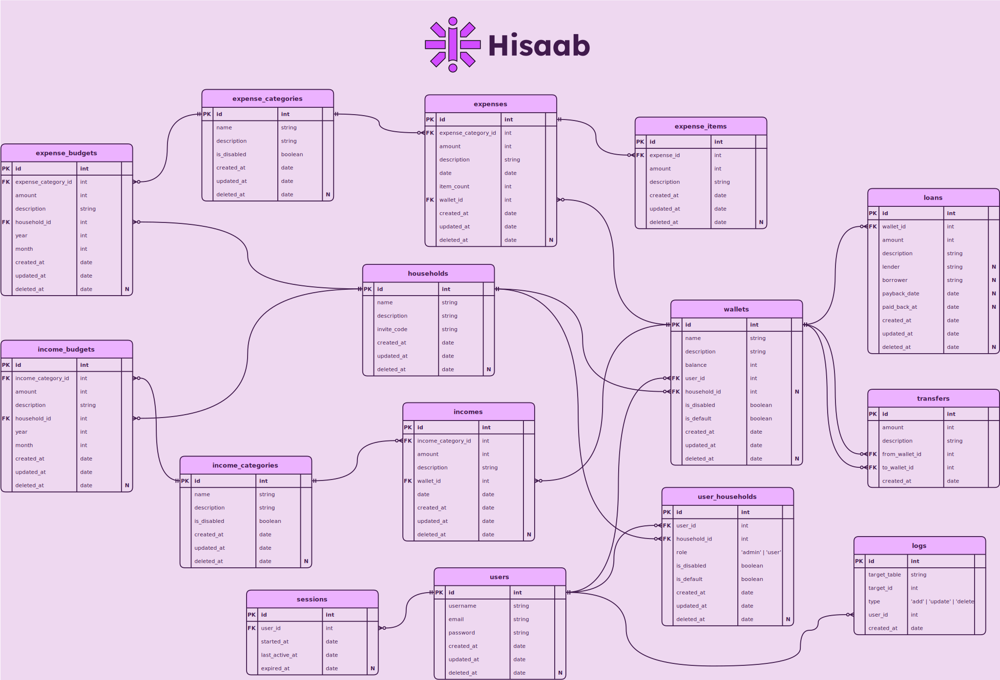

# Hisaab

Hisaab is a personal finance management tool that helps you keep track of your expenses and income.

## Architecture

- Code Spell Checker as spell checker (linter)
- Eslint for code quality (linter)
- Prettier for formatting
- Typescript for type-safe code
- Remix SSR
- React
- Typescript
- Mantine
- Tabler Icons
- CSS Modules
- Zod
- Offline first with Watermelon DB
- Hosted on Deno Deploy
- SQLite (libSQL) as DB on Turso
- Drizzle as ORM

## ERD

## Getting Started

- [Setup Turso CLI](https://docs.turso.tech/cli/installation)
- Setup Node.js LTS and pnpm
- Install dependencies with `pnpm i`
- Start development server with `pnpm dev`
